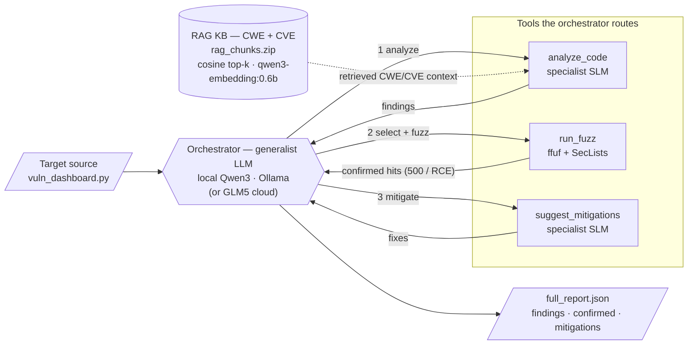
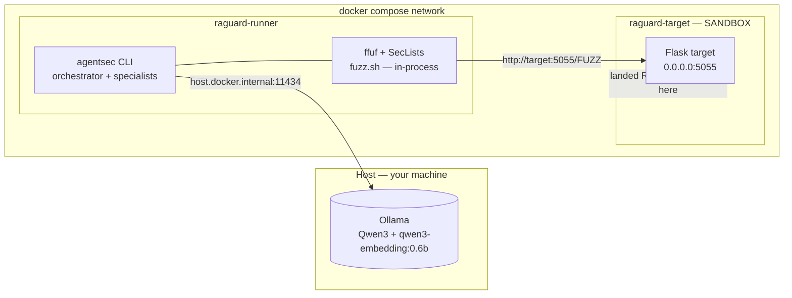
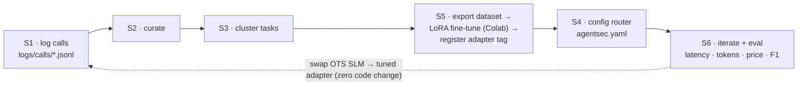

# RaGuard — Architecture

Three views for the defense: the **agentic pipeline** (what the system does), the
**runtime isolation topology** (how it stays safe), and the **S1–S6 conversion
flywheel** (the thesis methodology). All three render on GitHub; screenshot them
into slides, or open the presentation-ready page in `docs/architecture.html`.

---

## 1. The agentic pipeline

A generalist **orchestrator** routes narrow **specialist SLMs**, grounds analysis
in a **RAG** knowledge base, and closes the loop by **dynamically confirming**
each static finding with a fuzzer before proposing a fix.



**Read it as:** source → analyze (RAG-grounded) → fuzz to *confirm* → mitigate →
report. In the **deterministic** mode this order is fixed; in **`--agentic`** mode
the orchestrator decides the order via a tool-calling loop.

---

## 2. Runtime isolation topology

`docker compose up` brings up two containers: the **runner** (orchestrator,
specialists, and the fuzzer) and the **intentionally-vulnerable target**. Only
Ollama stays on the host, because it needs the GPU. A payload that lands stays
inside the target sandbox.



`docker compose up` starts both and runs the whole pipeline. The runner reaches
the target by **service name** over the compose network — no host hairpin, so
the target's port is published only to `127.0.0.1`.

The fuzzer is *inside* the runner rather than a container the pipeline spawns:
a containerised orchestrator can only call `docker run` with
`/var/run/docker.sock` mounted, which would grant it effective root on the host
and defeat the containment below. `run_fuzz` detects its environment — in the
runner it executes `fuzz.sh` directly; run from the host it spawns the
standalone `vuln-fuzzer` image as before.

Containment on the target follows the [OWASP Docker Security Cheat
Sheet](https://cheatsheetseries.owasp.org/cheatsheets/Docker_Security_Cheat_Sheet.html):
runs as **uid 10001, never root**; `privileged: false`; `cap_drop: ALL` (zero
effective capabilities — `ping` for the CWE-78 endpoint works via unprivileged
ICMP sockets, enabled by the `ping_group_range` sysctl, so `NET_RAW` is no
longer granted); `no-new-privileges`; a **read-only root filesystem** with
writable state confined to two `noexec,nosuid` tmpfs mounts (`/data` for the
SQLite DB, `/tmp`); and `cpus` / `mem_limit` / `pids_limit` / `ulimits` ceilings
so a landed payload cannot DoS the host.

To also cut the target's **outbound** access — blocking reverse shells and data
exfiltration, at the cost of the `/fetch` SSRF demo to the public internet —
attach it to an internal network:

```yaml
services:
  target:
    networks: [sandbox]
networks:
  sandbox:
    internal: true
```

The design intent is that an exploit **lands** — so the fuzzer can confirm it —
but lands as an unprivileged user on an immutable filesystem with no
capabilities. Verified by exploiting the container's own CWE-78 RCE: writes to
`/app` and `/etc` return `EROFS`, `CapEff` is `0000000000000000`, and a binary
dropped in `/tmp` cannot be executed.

---

## 3. The S1–S6 LLM→SLM conversion flywheel

The thesis methodology (NVIDIA, *SLMs are the Future of Agentic AI*,
[arXiv:2506.02153](https://arxiv.org/abs/2506.02153)): turn expensive generalist
calls into cheap fine-tuned specialists, and measure the payoff.



**S4 is the pivot:** one versioned `config/agentsec.yaml` routes every task, so
swapping an off-the-shelf SLM for a fine-tuned adapter — or the local orchestrator
for the GLM5 cloud model — is a one-line change and a clean rollback point.
